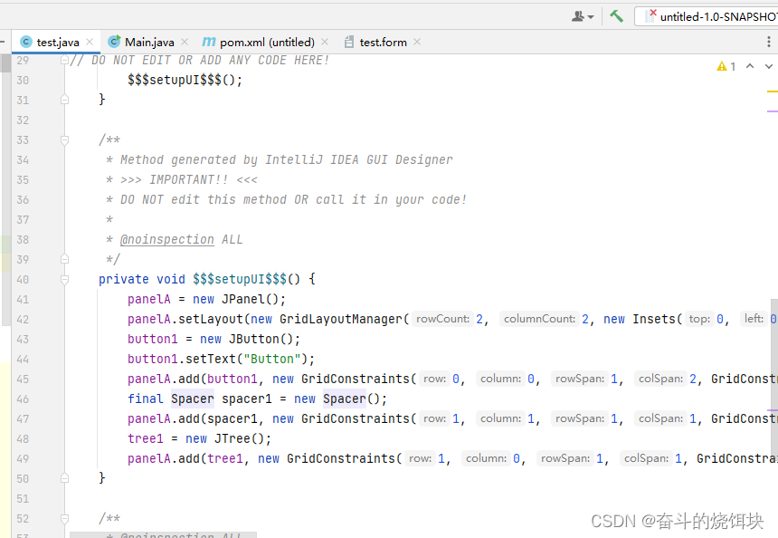

# notice-swing

给wzn, dxf拷贝下载一些公告

Swing是一个用于开发Java应用程序用户界面的开发工具包。   
以抽象窗口工具包（AWT）为基础使跨平台应用程序可以使用任何可插拔的外观风格。     
Swing开发人员只用很少的代码就可以利用Swing丰富、灵活的功能和模块化组件来创建优雅的用户界面。   
工具包中所有的包都是以swing作为名称
下个版本可以考虑试试JFormDesigner开发

## IDEA Swing设计器 生成以后 进行打包无法运行的解决方案
原因是GUI默认生成的二进制文件+forms_rt依赖导致。

1.修改默认生成Java源代码

2.增加forms_rt的依赖

        <dependency>
            <groupId>com.intellij</groupId>
            <artifactId>forms_rt</artifactId>
            <version>7.0.3</version>
        </dependency>
 
3.重新package即可

4.可以看到已经生成了setUp
 